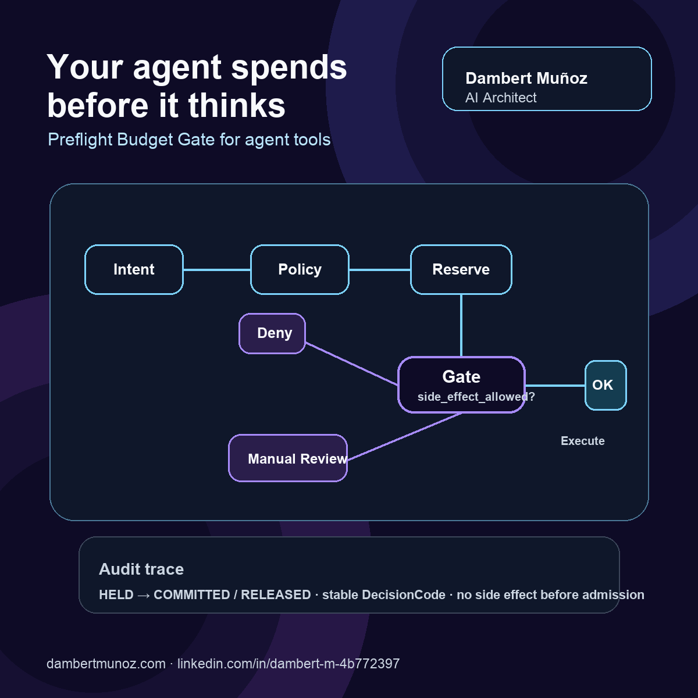

# Preflight Budget Gate Lab

> A public AI architecture demo by **Dambert Muñoz** — AI Architect focused on agentic systems, iOS architecture, developer tooling, and production-grade software engineering.

- Website: [dambertmunoz.com](https://dambertmunoz.com/)
- LinkedIn: [Dambert Muñoz](https://www.linkedin.com/in/dambert-m-4b772397/)



## Thesis: your agent spends before it thinks

Most agent demos meter cost after the tool call. That is not governance; it is incident reporting.

This repo demonstrates a smaller but more important primitive: **preflight admission control for agent actions**. Before any side-effecting tool can run, the planner must declare:

- what it intends to do;
- why it wants to do it;
- estimated token/cost impact;
- risk class;
- idempotency key.

Then a deterministic governor decides whether to `execute`, route to `manual_review`, or `deny`.

Posthoc evaluators answer: **“What happened?”**  
Preflight gates answer: **“Should this be allowed to happen?”**

For agents with tools, the second question has to come first.

## Why I built this

I am Dambert Muñoz, an AI Architect and senior mobile/software engineering lead building agentic workflows, architecture tooling, and production-grade automation. My bias is simple: AI demos are not enough. If an agent can call tools, publish content, mutate records, trigger builds, or spend budget, then it needs explicit operational boundaries.

This lab is a compact version of that boundary.

It is intentionally offline, typed, deterministic, and small enough to inspect in minutes. The goal is not to showcase a framework. The goal is to show the **control surface** a serious agent system needs before side effects happen.

## Demo objective

Build an offline, production-shaped state graph where:

1. the planner emits an `ActionIntent`;
2. the policy classifies admission without mutating state;
3. the ledger reserves budget before execution;
4. the executor only runs when `side_effect_allowed=True`;
5. the ledger commits only after tool success;
6. failures release the reservation before the commit boundary;
7. every route emits an auditable event with stable decision codes.

## Architecture

```text
planner
  -> ActionIntent(tool, purpose, estimated_tokens, risk, idempotency_key)
  -> pure BudgetPolicy.classify(intent)
  -> ReservationLedger.reserve(intent)
  -> route
       ├─ execute        reserve -> tool succeeds -> commit
       ├─ manual_review  reserve -> hold -> no tool call
       └─ deny           no tool call; no reservation unless released failure evidence
```

The point is not to build a billing platform. The point is to show the boundary that most agent demos skip: **admission control before execution**.

## What this is

- A minimal admission-control pattern for agent tool calls.
- A typed contract between planner, policy, ledger, executor, and audit event.
- A deterministic offline demo for reasoning about cost and risk before side effects.
- A small example of turning “token tracking” into an operational safety primitive.
- A repo designed for a public Staff/Architect-level architecture discussion, not a toy “hello agent”.

## What this is not

- Not a billing platform.
- Not an observability dashboard.
- Not a LangGraph dependency showcase.
- Not an enterprise policy engine.
- Not a claim that cost is the only dimension of agent governance.

## Architecture invariants

1. The executor never runs unless `side_effect_allowed=True`.
2. Budget is reserved before execution and committed only after tool success.
3. Public side effects route to `manual_review` and do not execute automatically.
4. Denied actions do not execute tools.
5. Failed pre-commit executions release their reservation.
6. Idempotency keys reject conflicting replays, not just duplicate strings.
7. Every route emits an `AuditEvent` with stable `DecisionCode` values.

## Design tradeoffs

- The policy is deterministic on purpose. Governance should not depend on another LLM call.
- The ledger is in-memory because the repo demonstrates the boundary, not storage infrastructure.
- Manual review holds the reservation to avoid budget races; real systems would add TTL/expiry.
- Risk classes are coarse because the point is admission control, not taxonomy completeness.
- `DecisionCode` is an enum because audit pipelines should not depend on free-form strings.
- The repo avoids external services so the architectural behavior is reproducible in seconds.

## What to inspect

- `budget_gate_lab/state.py` — typed `ActionIntent`, `DecisionCode`, `ReservationStatus`, `Decision`, `AuditEvent`, and `PreflightResult`.
- `budget_gate_lab/policy.py` — pure deterministic admission policy; it does not mutate the ledger.
- `budget_gate_lab/ledger.py` — reservation lifecycle: `HELD`, `COMMITTED`, `RELEASED`, plus idempotency-conflict detection.
- `budget_gate_lab/graph.py` — orchestration boundary: classify, reserve, route, execute, commit/release, audit.
- `tests/test_budget_gate.py` — property-style invariants plus happy/failure cases.
- `docs/architecture.md` — deeper architecture note and diagram.
- `docs/linkedin-post.md` — polished LinkedIn draft for this demo.
- `docs/social-card-prompt.md` — image-generation prompt for a LinkedIn visual.
- `assets/preflight-budget-gate-social-card.png` — ready-to-post LinkedIn social card.
- `docs/audit-trace.example.json` — example trace emitted for a public side effect.

## Run

```bash
python3.11 -m pytest -q
python3.11 -m budget_gate_lab.demo
```

Expected demo output:

```text
route=manual_review
reason=public_side_effect_requires_manual_review
tool_executed=False
audit_event={...}
```

## Production extensions intentionally excluded

- Durable ledger storage.
- TTL-based reservation expiry.
- Per-user/team/org budgets.
- Real human approval workflow.
- Tool-specific pricing models.
- Distributed locking.
- Audit sink integration.

Those are important, but adding them here would hide the core primitive: **reserve before side effects, commit only after success, and make denial/review auditable**.

## Author

**Dambert Muñoz**  
AI Architect · Senior iOS / Software Architecture Lead · Builder of agentic engineering systems

- Website: [https://dambertmunoz.com/](https://dambertmunoz.com/)
- LinkedIn: [https://www.linkedin.com/in/dambert-m-4b772397/](https://www.linkedin.com/in/dambert-m-4b772397/)
